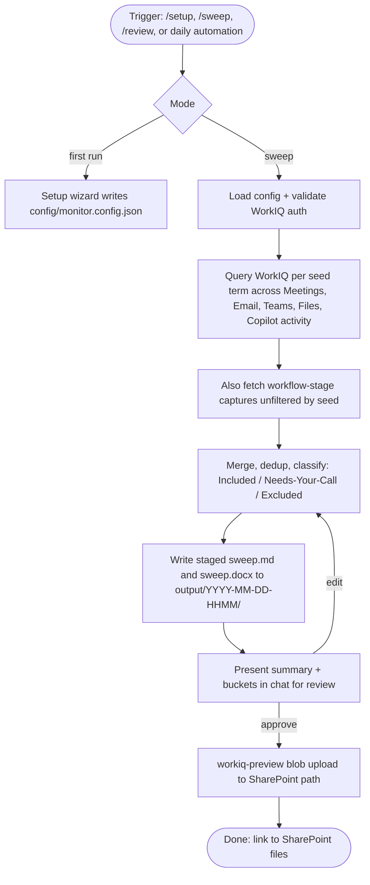

# Reply Daily Activity Monitor

A configurable, shareable Cursor Agent + Cursor Automation that sweeps a person's Microsoft 365 activity (Teams, Outlook, meetings, files, Copilot activity) for user-defined seed terms and workflow stages, presents the results in chat for review, and writes both Markdown and Word outputs to a chosen SharePoint location.

Data access is done entirely through Microsoft's [WorkIQ MCP server](https://github.com/microsoft/work-iq) - the monitor never handles raw M365 credentials, and every request runs under the signed-in Entra ID user's own permissions.

## Quick start

1. Install the prereqs from [SETUP.md#1-prerequisites](SETUP.md#1-prerequisites).
2. Clone this repo (or unzip a shared bundle) and open it in Cursor.
3. In a Cursor chat inside the workspace, type `/setup`.
4. Type `/sweep` when you want to run your first sweep.
5. Approve the sweep in chat when the review prompt appears - the monitor uploads both `sweep.md` and `sweep.docx` to the SharePoint folder you configured.

Full walkthrough is in [SETUP.md](SETUP.md).

## What it does

## Slash commands

The monitor is driven from Cursor chat. Once installed, you can run:

- `/setup` - interactive wizard defined in [prompts/setup.md](prompts/setup.md). Captures seed terms, workflow stages, meetings/people/emails scope, SharePoint destination, and daily schedule. Writes `config/monitor.config.json` (gitignored).
- `/sweep` - the sweep orchestrator defined in [prompts/sweep.md](prompts/sweep.md). Queries WorkIQ across five surfaces, classifies items into Included / Needs-Your-Call / Excluded buckets, and stages `sweep.md` + `sweep.docx` under `output/<timestamp>/`.
- `/review` - the review + upload flow defined in [prompts/review-and-write.md](prompts/review-and-write.md). Loads the newest staged sweep, walks the Needs-Your-Call bucket, and on explicit approval uploads both files to SharePoint via the `workiq-preview` MCP.
- `/export` - builds a clean shareable zip (`dist/reply-daily-activity-monitor.zip`) via [scripts/export-package.ps1](scripts/export-package.ps1). Zero user data - safe to send to anyone at Reply.

The scheduled daily run is installed by `/setup` as a Cursor Automation using the template in [automations/daily-sweep.json](automations/daily-sweep.json). Per the design, scheduled runs also pause for chat review - they never auto-upload to SharePoint.

## Design guardrails

These are enforced by [.cursor/rules/monitor.md](.cursor/rules/monitor.md) and by the review flow:

- **Read-only against M365.** The monitor never sends email, posts to Teams, or edits shared files.
- **No SharePoint write without explicit chat approval.** Every upload requires a review turn - scheduled runs included.
- **No credentials in chat.** WorkIQ handles Entra ID sign-in via device-code flow. The monitor never asks the user to paste tokens.
- **No user data in the shareable export.** `/export` strips `config/monitor.config.json`, `output/`, `.git/`, and any `.env*` files, and verifies the strip before zipping.
- **No invented M365 data.** If WorkIQ returns nothing for a query, the sweep says so.

## Repository layout

- [README.md](README.md) - this file.
- [SETUP.md](SETUP.md) - recipient-facing install and troubleshooting.
- [.cursor/mcp.json](.cursor/mcp.json) - registers the `workiq` and `workiq-preview` MCP servers.
- [.cursor/rules/monitor.md](.cursor/rules/monitor.md) - project rule that binds slash commands to prompt files and enforces the guardrails above.
- [prompts/setup.md](prompts/setup.md) - setup wizard.
- [prompts/sweep.md](prompts/sweep.md) - sweep orchestration and Markdown output contract.
- [prompts/review-and-write.md](prompts/review-and-write.md) - review + SharePoint upload.
- [schemas/monitor.config.schema.json](schemas/monitor.config.schema.json) - JSON Schema for the per-user config.
- [config/monitor.config.example.json](config/monitor.config.example.json) - template config (no user data).
- `config/monitor.config.json` - the user's local config (gitignored, created by `/setup`).
- [scripts/render-docx.ps1](scripts/render-docx.ps1) - pandoc wrapper that produces `sweep.docx` from `sweep.md`.
- [scripts/export-package.ps1](scripts/export-package.ps1) - builds the shareable zip.
- [automations/daily-sweep.json](automations/daily-sweep.json) - Cursor Automation template consumed by `/setup`.
- `output/` - gitignored per-run staging folder.
- `dist/` - gitignored shareable-package build output.

## Concepts

### Seed terms

A curated trigger keyword or short phrase the monitor searches for across meetings, email, and Teams to decide whether an item is potentially in-scope. Seed terms are the **primary filter**, not the exclusive one - the monitor also captures workflow-stage items even when no seed matches. Weak / single-term / ambiguous matches go to a "Needs Your Call" bucket rather than being auto-included, and matches only in a taxonomy field value are excluded by default.

### Workflow stages

Named end-to-end stages of the tracked workstream (e.g. Discovery, Design, Build, Test, Deploy, Sign-off). Items that reference a stage in a workflow context are captured even when no seed term matches, so the monitor keeps you aware of stage handoffs and approvals.

### Review buckets

Every sweep places each hit into one of three buckets:

- **Included** - strong signals: multi-term matches, matches in high-value fields, or items involving people/chats you explicitly opted into.
- **Needs Your Call** - single-term matches in low-context fields, or generic terms that could match adjacent content. You promote or drop each of these in chat.
- **Excluded** - taxonomy-only matches and duplicates. Reported by count in the output for transparency; not enumerated.

## Non-goals for v1

- No support for a second tenant (Valorem). The config schema leaves a hook for it, and the setup wizard tells the user multi-tenant is planned.
- No raw meeting recording downloads. The monitor captures recap + transcript excerpts via WorkIQ instead.
- No custom Microsoft Graph SDK code. All M365 reads/writes flow through WorkIQ MCP - the sweep uses `workiq`, and the upload uses `workiq-preview`.
